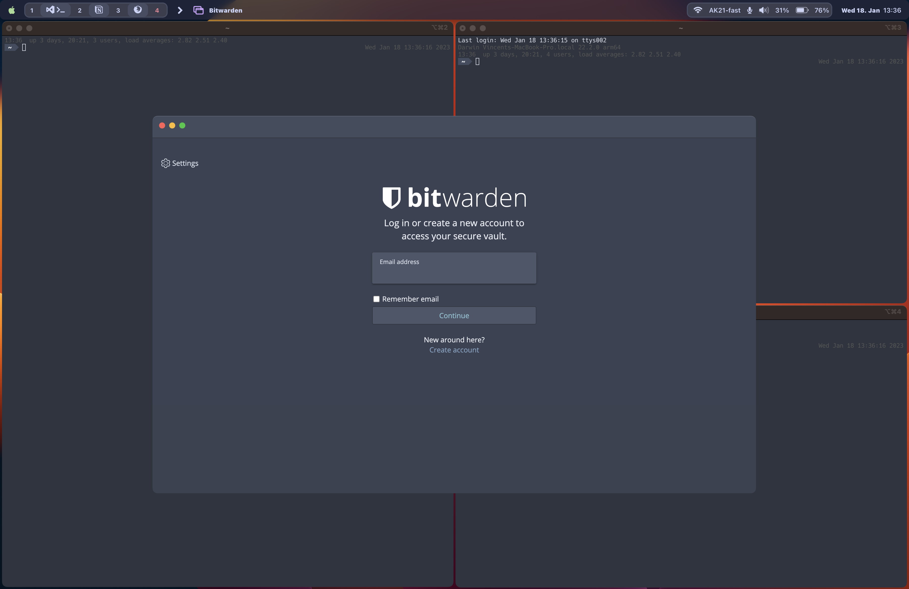

## Dotfiles
My current dotfiles for making life more productive.

### Tiling Experience
I love i3 (or tiling window managers in general). That's why I tried to create an as close as possible experience on macos.

Tools:
- [yabai](https://github.com/koekeishiya/yabai) (tiling window manager) 
- [skhd](https://github.com/koekeishiya/skhd) (hotkey daemon) 

I've tried to add the scratchpad functionality to macos. You can find two scripts (scratchpad.sh, minimize_scratchpad.sh), which open (and closing, when out of focus) certain applications.

#### Alternative Menu Bar
There are various options for an alternative menu bar (Options to display current focused space):

1. [Uebersicht](https://github.com/felixhageloh/uebersicht ) with [simple-bar](https://github.com/Jean-Tinland/simple-bar) (or any other Uebersicht bar): Javascript based bar. Uebersicht can be used for other fancy widgets as well. Compared to the other solutions, it is quiet heavy and has a little delay, but it's the most beautiful and feature rich option.

2. [Spacebar](https://github.com/cmacrae/spacebar): Minimal bar written in c. Very responsive, but very limited options for adding information.

3. [Bitbar](https://github.com/matryer/bitbar) with [shell script](https://github.com/SxC97/Yabai-Spaces): Just puts output of shell scripts (In this case all spaces listed) in the normal macos Menu bar. 

For the first two solutions, you have to hide macos bar (similar to dock): System Preferences --> Dock & Menu Bar --> Automatically hide and show Menu Bar

I'm currently using spacebar.

## Credits
Like most/all dotfiles, a lot of stuff has been found somewhere on the internet (basically reddit or github). Sorry for not crediting!
I've started my yabai and skhd config with https://github.com/Julian-Heng/chunkwm-yabai-config.
https://github.com/camspiers/dotfiles
https://github.com/stephen-huan/macos-dotfiles
https://github.com/koekeishiya/dotfiles
